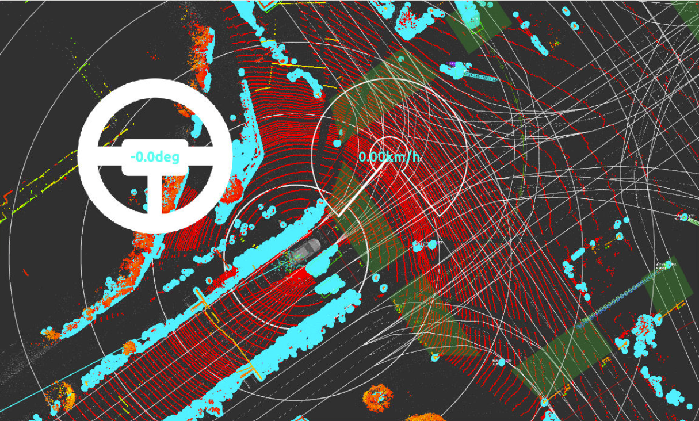

# Tutorial 2: Localization using NDT Scan Matching

The purpose of this tutorial is to show some features of Autoware's localization, which is achieved through a method called NDT Scan Matching. At a very basic level, NDT (Normal Distribution Transform) Scan Matching is an algorithm that is used to match LiDAR sensor data with an existing LiDAR point cloud map, in order to determine where the ego-vehicle is located. For a more detailed description of how the algorithm works, [read this Medium article by David Silver](https://medium.com/self-driving-cars/ndt-matching-acff8e7e01cb).

## Automatic self-pose estimation using GNSS

In the past, for Autoware to successfully localize the ego vehicle, it was necessary to manually set the initial pose of the ego-vehicle, or to have recorded data containing a manually set initial pose. It is now possible for Autoware to estimate the initial pose of the ego-vehicle automatically using GNSS sensor data. This is a new feature that is planned to be added to Autoware.Auto in the near future.

Before starting, please download and unpack the following files (note that the map and first rosbag file are the same as those used in the first tutorial):

* [Tutorial 2 map files](https://drive.google.com/open?id=1ovrJcFS5CZ2H51D8xVWNtEvj_oiXW-zk)
* [Tutorial 2 rosbag](https://drive.google.com/open?id=1BFcNjIBUVKwupPByATYczv2X4qZtdAeD)
* [Tutorial 2 rosbag (minus GNSS data)](https://drive.google.com/file/d/1QT09AWKV_LNUzvTu1n4cWPPikygz7lQA/view)

> Note that the first two files are the same files used in the [rosbag quick launch tutorial](../../README.md#rosbag-simulation)

1. Open two terminal windows and run the following commands in *both* terminals

```bash
cd /home/autoware/autoware.proj
source ./install/setup.bash
```

2. In the first terminal, launch RViz

```bash
roslaunch autoware_launch logging_simulator.launch vehicle_model:=lexus sensor_model:=aip_xx1 map_path:=/path/to/tutorial2_maps
```

3. In the second terminal, play the rosbag file

```bash
rosbag play --clock -r 0.5 /path/to/tutorial2_rosbags/sample.bag
```

4. In the still active second terminal, hit the spacebar after a second to pause rosbag playback, then change the Target Frame of the view to "base_link" in RViz.

- In the Views panel on the left side of the window, double-click the Target Frame value and select "base_link"
- Click the "Zero" button


5. Hit the spacebar in the second terminal to resume rosbag playback and return to RViz

Whilst still in the 2D TopDownOrth view, we can see the recorded LiDAR sensor data being displayed first, and then after a few seconds, the NDT Scan Matching algorithm is able to match up the LiDAR sensor data with the high-definition pointcloud map data loaded into memory by using recorded GNSS data to establish the initial pose of the ego-vehicle.



6. Once the rosbag playback has completed, click on the first terminal and press Ctrl + C to end the running roslaunch command, then close the Terminator window.

## Pose estimation without GNSS initial pose

If GNSS data is not available, then the initial pose of the ego-vehicle can be manually set using RViz (something that we will come back to in the next exercise). For now, let's see what happens if we try to replay a rosbag with GNSS sensor data removed.

7. Open two new terminal windows and run the following commands in *both* terminals

```bash
cd /home/autoware/autoware.proj
source ./install/setup.bash
```

8. In the first terminal, launch RViz

```bash
roslaunch autoware_launch logging_simulator.launch vehicle_model:=lexus sensor_model:=aip_xx1 map_path:=/home/autoware/handson/ex3/maps
```

9. In the second terminal, play the rosbag file

```bash
rosbag play /path/to/tutorial2_rosbags/sample_no_gnss.bag --clock -r 0.5
```

10. In the still active second terminal, hit the spacebar after a second to pause rosbag playback, then change the Target Frame of the view to "base_link" in RViz again.

11. Hit the spacebar in the second terminal to resume rosbag playback and return to RViz

The view shows the ego-vehicle and the recorded LiDAR sensor data as before, but the HD map is not displayed because it's impossible for the NDT Scan Matching algorithm to match the LiDAR sensor data to the map's pointcloud data without an initial pose.


12. Click on the first terminal and press Ctrl + C to end the running roslaunch command, then close the Terminator window.

So now we're going to try again, but this time we will set an initial pose manually to see what happens.

13. Repeat steps 7-10, but this time wait around 5 seconds before hitting the spacebar to pause the rosbag's playback. The reason for doing so is to allow for ROS time to be initialised so that an initial pose can be manually set.

14. Go back to RViz, scroll the map to the approximate position of where the ego-vehicle should be


15. Set the initial pose of the ego-vehicle manually.

- Click “2D Pose estimate” button in the toolbar, or hit the “P” key


- Click and hold the left-mouse button, and then drag to set the direction of the pose

16. Go back to the second terminal and hit spacebar to resume playback

Now, things should work in much the same way as they did at the start of the exercise, when GNSS sensor data was available. Given an initial pose, the NDT Scan Matching algorithm is now able to match the sensor data with the map's pointcloud data!

17. Once the rosbag playback has completed, click on the first terminal and press Ctrl + C to stop RViz, then close both terminals.

| Next |
| ---- |
| [Tutorial 3: Simulation testing with dummy objects](3_simulation.md) |
