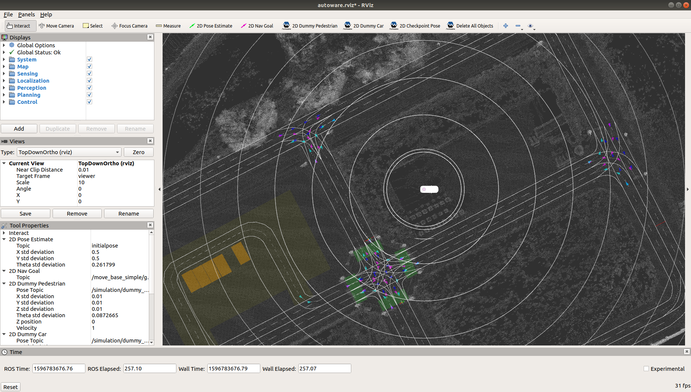
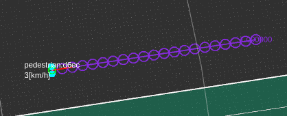
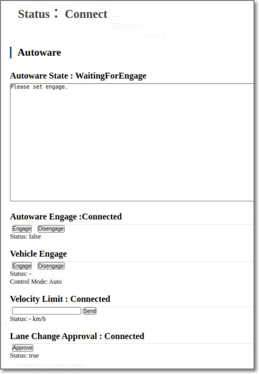
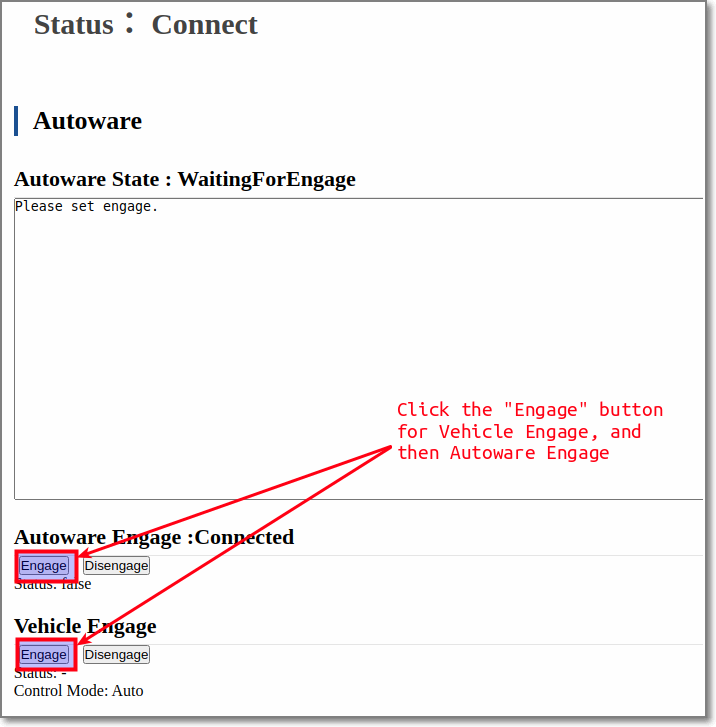
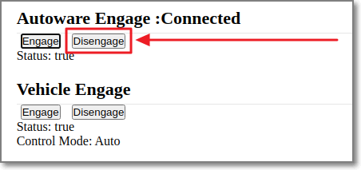
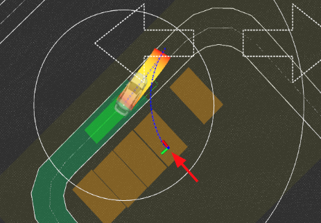

# Tutorial 3: Simulation testing with dummy objects

The purpose of this tutorial is to become familiar with Autoware's planning simulator, which can be used for a variety of things such as validating vector maps (containing metadata about the road layout, traffic rules etc) and verifying Autoware's route planning functionality.

For this exercise, we will only need to use a single terminal window.

Before starting, please download and unpack the following files:

* [Tutorial 3 maps](https://drive.google.com/open?id=197kgRfSomZzaSbRrjWTx614le2qN-oxx)

> Note that these are the same files used in the [Planning Simulator quick launch tutorial](../../README.md#planning-simulator)

## Run RViz and set initial and goal poses

1. Open a terminal window, navigate to the Autoware.IV install directory and run the following command:

```bash
source ./install/setup.bash
```

2. Run RViz with the following command:

```bash
roslaunch autoware_launch planning_simulator.launch vehicle_model:=lexus sensor_model:=aip_xx1 map_path:=/path/to/tutorial3_maps
```



3. Set the initial pose of the ego-vehicle

- Click “2D Pose estimate” button in the toolbar, or hit the “P” key


- Click and hold the left-mouse button, and then drag to set the direction of the pose


4. Set the goal pose of the ego-vehicle

- Click the “2D Nav Goal” button in the toolbar, or hit the “G” key


- Click and hold the left-mouse button, and then drag to set the direction of the pose


5. Confirm initial pose, goal pose and route are displayed


---

## Adding and removing dummy obstacles, both moving and stationary

6. Add a dummy car

- Click the “2D Dummy Car” button in the toolbar, or hit the “K” key

- Click and hold the left-mouse button, and then drag to set the direction of the pose


7. Add a dummy pedestrian

- Click the “2D Dummy Pedestrian” button in the toolbar, or hit the “L” key

- Click and hold the left-mouse button, and then drag to set the direction of the pose


8. Make dummy pedestrians and dummy vehicles stationary, and add a stationary dummy vehicle

- In the [Tool Properties] panel in the lower-left, under [2D Dummy Car], set Velocity to 0
- Click the “2D Dummy Car” button
- Click and hold the left-mouse button, and then drag to set the direction of the pose
- In the [Tool Properties] panel in the lower-left, under [2D Dummy Pedestrian], set Velocity to 0


9. Remove all dummy objects

- Click “Delete All Objects” button in the toolbar, or hit the “D” key

- Click the display

---

## "Number One, Engage!"

10. Adjust RViz viewpoint to ThirdPersonFollower to change from a top-down 2D view to a 3D view

- In the Views panel on the left side of the window, click the Type dropdown box and select "ThirdPersonFollower"
- Double-click the Target Frame value and select "base_link"
- Click the “Zero” button


11. Use the Autoware Web UI to start the ego vehicle moving

- Open a browser and go to <http://localhost:8085/autoware_web_controller> (note that the web page may take a couple of minutes to appear)


- Under "Vehicle Engage”, click the "Engage" button
- Under “Autoware Engage: Connected”, click the “Engage” button


- In the Web UI, Autoware State will change from "WaitingForEngage" to "Driving" and the ego-vehicle should now start moving along the route to the goal pose


---

## Bonus: Simulate a parking maneuver

12. Once the ego-vehicle has reached the goal pose and stopped moving, use the Autoware Web UI to disengage the vehicle
- Under “Autoware Engage: Connected”, click the “Disengage” button



13. Set a new initial pose for the ego vehicle, and then set a goal pose that is in a parking area.

14. Use the Autoware Web UI to start the ego vehicle moving
- Under “Autoware Engage: Connected”, click the “Engage” button



14. To finish, click on the terminal window and press Ctrl + C to stop RViz, then close the terminal.